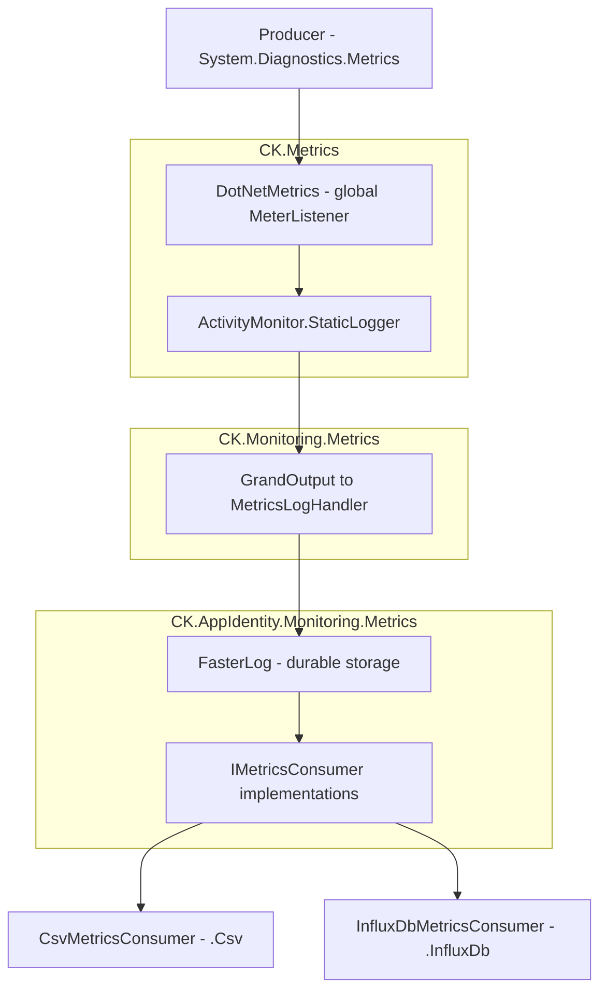

# CK-Metrics architecture

Each stage belongs to a different package, which is what makes referencing the last one sufficient:

```mermaid
flowchart TB
    P["Producer - System.Diagnostics.Metrics"]
    subgraph M["CK.Metrics"]
        D["DotNetMetrics - global MeterListener"]
        S["ActivityMonitor.StaticLogger"]
    end
    subgraph MM["CK.Monitoring.Metrics"]
        H["GrandOutput to MetricsLogHandler"]
    end
    subgraph AM["CK.AppIdentity.Monitoring.Metrics"]
        F["FasterLog - durable storage"]
        C["IMetricsConsumer implementations"]
    end
    CSV["CsvMetricsConsumer - .Csv"]
    IDB["InfluxDbMetricsConsumer - .InfluxDb"]

    P --> D
    D --> S
    S --> H
    H --> F
    F --> C
    C --> CSV
    C --> IDB
```

